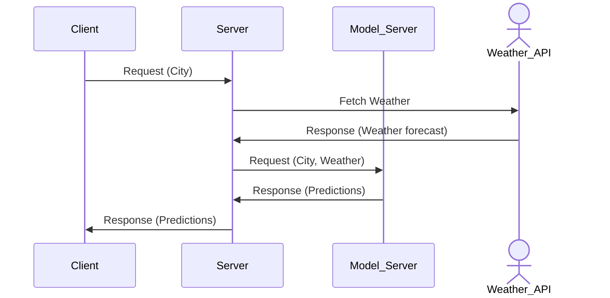

[Mermaid](https://mermaid.js.org/)

```
sequenceDiagram
    participant Client
    participant Server
    participant Model_Server
    actor Weather_API
    Client->>Server: Request (City)
    Server->>Weather_API: Fetch Weather
    Weather_API->>Server: Response (Weather forecast)
    Server->>Model_Server: Request (City, Weather)
    Model_Server->>Server: Response (Predictions)
    Server->>Client: Response (Predictions)
```


